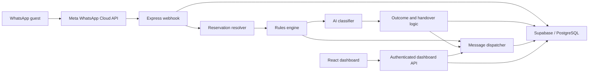

# WhatsApp Guest Support

AI-assisted WhatsApp guest support for apartment reservations and maintenance operations. The repository contains an Express/Supabase backend and a React dashboard for conversations, automation settings, delivery states, and human handover.

## What is implemented

- Meta WhatsApp webhook verification and HMAC signature validation
- Inbound message storage and outbound delivery-status reconciliation
- Reservation matching by phone, Booking ID, existing conversation, and guest-name fallback
- Deterministic rules for structured guest information such as Wi-Fi, parking, check-in, and check-out
- AI classification into `safe_reply`, `clarification_needed`, or `human_handover`
- Dashboard-controlled AI auto-reply and clarification settings with an emergency server override
- Human handover, assignment, Take Over, manual mode, human replies, and automation resume
- Transaction-safe escalation create/resolve operations and audit events
- Authenticated dashboard APIs, rate limiting, automated tests, coverage thresholds, and CI

## Architecture



See [Developer Guide](docs/DEVELOPER_GUIDE.md) for the complete processing flow.

## Repository structure

```text
whatsapp-guest-support/
|-- backend/
|   |-- src/
|   |   |-- db/                 # Supabase client and SQL migrations
|   |   |-- middleware/         # API auth, operator identity, webhook signature
|   |   |-- routes/             # Dashboard API and Meta webhook routes
|   |   `-- services/           # AI, rules, reservations, handover, messages
|   |-- test/                   # Unit, route, migration, and integration tests
|   |-- .env.example
|   `-- package.json
|-- frontend/
|   |-- src/                    # React dashboard and API service helpers
|   |-- test/
|   |-- .env.example
|   `-- package.json
|-- docs/                       # Developer, API, database, testing, operations
`-- .github/workflows/          # Default CI and test-database workflow
```

## Prerequisites

- Node.js 22 recommended for the complete lint, test, and built-in coverage workflow
- A Supabase/PostgreSQL project
- A Meta app with WhatsApp Cloud API access
- An OpenAI API key if AI classification is required

## Backend quick start

```powershell
cd backend
Copy-Item .env.example .env
npm.cmd ci
npm.cmd run migrate
npm.cmd run dev
```

On macOS/Linux, use `cp .env.example .env` and `npm` instead of `npm.cmd`.

Complete the values in `backend/.env` before starting. The server validates the critical WhatsApp, Supabase, and webhook variables at startup. `LLM_API_KEY` is required for real AI classification; without it the classifier fails safely to human handover.

Do not run migrations against production without a current backup and a reviewed deployment plan. See [Database and Migrations](docs/DATABASE_AND_MIGRATIONS.md).

## Frontend quick start

```powershell
cd frontend
Copy-Item .env.example .env
npm.cmd ci
npm.cmd run dev
```

The dashboard defaults to `http://localhost:3000` for its backend. Configure the public Supabase URL and anon key, then sign in with a manually provisioned Supabase Auth user linked to `admin_users.auth_user_id`.

## Authentication

All `/api/*` routes require a Supabase Auth access token:

```http
Authorization: Bearer <SUPABASE_ACCESS_TOKEN>
```

The backend validates the token with Supabase Auth and resolves the operator through `admin_users.auth_user_id`. Browser-supplied operator IDs are not trusted. Webhook and health endpoints remain public.

## Key endpoints

| Method | Path | Purpose |
|---|---|---|
| `GET` | `/health` | Process and database health |
| `GET` | `/webhooks/whatsapp` | Meta verification handshake |
| `POST` | `/webhooks/whatsapp` | Inbound messages and delivery statuses |
| `GET` | `/api/conversations` | Dashboard conversation list |
| `POST` | `/api/conversations/:id/reply` | Persist and send an operator reply |
| `GET` | `/api/escalations` | Dashboard escalation list |
| `POST` | `/api/escalations/:id/take-over` | Claim an escalation and enter manual mode |
| `POST` | `/api/escalations/resolve` | Resolve a conversation and open escalation |
| `POST` | `/api/intents/classify` | Side-effect-free rules/AI classification preview |
| `GET` | `/api/settings/automation` | Read effective automation settings |
| `PATCH` | `/api/settings/automation` | Update automation settings |

See [API Reference](docs/API.md) for all endpoints, request bodies, authentication, and response examples.

## Quality checks

Backend:

```powershell
cd backend
npm.cmd run check
```

Frontend:

```powershell
cd frontend
npm.cmd run lint
npm.cmd test
npm.cmd run build
```

The backend quality gate enforces minimum coverage of 70% lines, 75% branches, and 60% functions. Database concurrency tests require a dedicated test database and are intentionally excluded from the normal test run. See [Testing Guide](docs/TESTING.md).

## Documentation

- [Developer Guide](docs/DEVELOPER_GUIDE.md)
- [API Reference](docs/API.md)
- [Database and Migrations](docs/DATABASE_AND_MIGRATIONS.md)
- [Testing Guide](docs/TESTING.md)
- [Operations Guide](docs/OPERATIONS.md)
- [Frontend Guide](frontend/README.md)

## Security essentials

- Never commit `.env` files, service-role keys, Meta secrets, access tokens, or API keys.
- Verify every production WhatsApp POST using `META_APP_SECRET`.
- Keep the Supabase service-role key server-side only.
- Use a dedicated database for integration tests.
- Keep AI automation disabled until reservation, policy, escalation, and delivery flows have been verified in the target environment.
