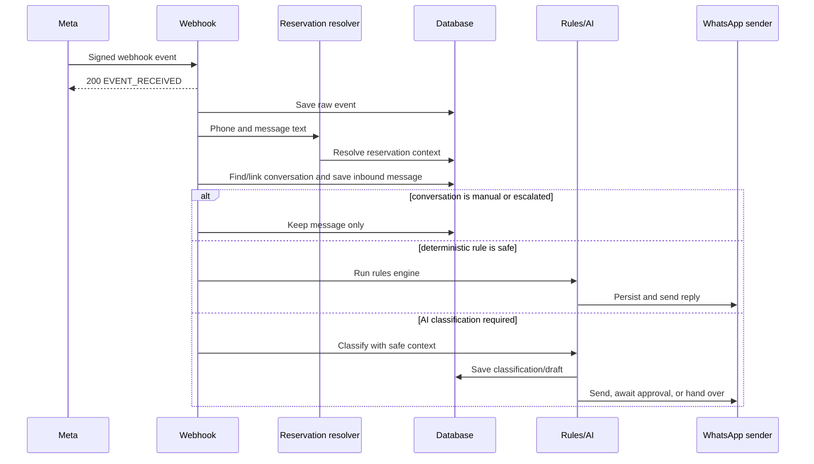
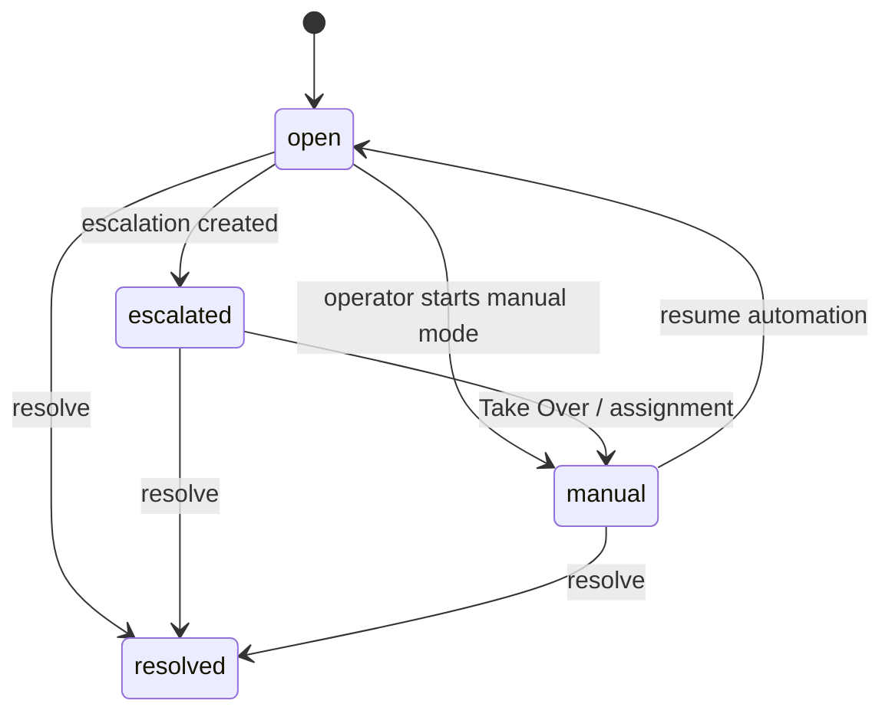

# Developer Guide

This guide explains the runtime architecture and the main development workflows. Use the focused guides for endpoint details, migrations, tests, and production operations.

## System components

| Component | Technology | Responsibility |
|---|---|---|
| Backend | Node.js, Express | Webhooks, dashboard APIs, orchestration, security middleware |
| Database | Supabase/PostgreSQL | Conversations, reservations, messages, settings, transactional workflows |
| AI | OpenAI client | Classification and guest-ready drafts for unhandled messages |
| WhatsApp | Meta Cloud API | Inbound webhooks, outbound messages, status events |
| Dashboard | React, Vite | Inbox, reservations, delivery status, automation, handover |

## Backend layout

```text
backend/
|-- server.js                         # Environment validation and HTTP startup
|-- migrate.js                        # Ordered SQL migration runner
|-- src/
|   |-- app.js                        # Express middleware and route mounting
|   |-- db/
|   |   |-- client.js                 # Service-role Supabase client
|   |   |-- rawEvents.js              # Raw webhook audit persistence
|   |   `-- migrations/               # 001..008 SQL migrations
|   |-- middleware/
|   |   |-- auth.js                   # Dashboard API-key authentication
|   |   |-- requireOperator.js        # X-Admin-User-Id validation
|   |   `-- validateWebhookSignature.js
|   |-- routes/
|   |   |-- api/                      # Dashboard/internal endpoints
|   |   `-- webhooks/whatsapp.js      # Meta verification and event ingestion
|   `-- services/
|       |-- ai/                       # Classifier and outcome actions
|       |-- conversations/            # Automation pause checks
|       |-- escalations/              # Idempotent escalation service
|       |-- handover/                 # Assignment/manual-mode RPC wrapper
|       |-- messages/                 # Persist/send and delivery reconciliation
|       |-- reservations/             # Identity and reservation resolution
|       |-- rules/                    # Deterministic structured answers
|       |-- settings/                 # Cached automation settings
|       `-- whatsapp/                 # Meta parser and sender
`-- test/
```

## Inbound WhatsApp processing

The POST webhook acknowledges Meta immediately, then processes every message asynchronously.



Raw events are stored for audit/debugging. Duplicate inbound messages are rejected by the unique WhatsApp message ID and do not run the response pipeline twice.

## Reservation and identity resolution

Resolution order is intentional:

1. Active reservation matching the WhatsApp phone number
2. Explicit Booking ID extracted from the guest message
3. A verified or provisional active conversation link
4. Explicit guest-name fallback

Possible match states:

| Status | Meaning | Sensitive context available to AI/rules |
|---|---|---:|
| `verified` | Phone or unique verified identifier matched | Yes |
| `provisional` | Unique guest name, Booking ID still required | No |
| `ambiguous` | Multiple candidates | No |
| `mismatch` | Supplied identifiers disagree | No |
| `unmatched` | No usable active reservation | No |

Guest-name matches only store a candidate link. They never expose apartment, access, Wi-Fi, address, booking, or policy details until Booking ID verification succeeds.

## Rules and AI

The rules engine runs before the AI classifier. It only returns a reply when the required structured reservation/apartment/policy data exists. Current deterministic topics include:

- Wi-Fi
- Parking
- Check-in time/location/directions
- Check-out time

If no deterministic answer is possible, `classifyAndDraft()` receives a compact context payload and returns:

- `safe_reply`
- `clarification_needed`
- `human_handover`

The classifier validates model JSON and fails safely to `human_handover` when the model, configuration, or response is unavailable/invalid.

### Outcome behavior

- A rules-engine reply is sent immediately for verified context.
- `safe_reply` auto-sends only when dashboard auto-reply is enabled, a verified reservation exists, and the conversation is not human-owned.
- `clarification_needed` auto-sends only when clarification sending is enabled and the conversation is not human-owned.
- `human_handover` idempotently creates/reuses an escalation and sends one holding message for a newly created escalation.
- When automatic sending is disabled, safe drafts remain available for operator review.

`POST /api/intents/classify` is different from the webhook outcome flow: it is a side-effect-free preview. It does not send WhatsApp messages, update conversation AI state, or create escalations.

## Automation settings

The single `automation_settings` row uses ID `global` and contains:

- `ai_auto_reply_enabled` (default `false`)
- `auto_send_clarifications` (default `true`)

The backend caches settings for 30 seconds. `AI_AUTO_REPLY_EMERGENCY_DISABLE=true` overrides both effective settings after a backend restart. If settings cannot be loaded during an automated outcome, the service fails closed and disables sending.

## Human handover

Conversation states:



Escalation states are `pending`, `acknowledged`, and `resolved`.

All handover mutations use PostgreSQL RPC functions. They lock the conversation row first and update the conversation, escalation, and audit event in one transaction. A partial unique index allows only one open escalation per conversation.

When a conversation is `manual` or `escalated`, inbound messages and read receipts continue to be stored, but rules and AI automation are skipped.

## Outbound messages and delivery status

Dashboard/human and automated dispatcher messages follow this order:

1. Insert an outbound message with `delivery_status=pending`.
2. Send through Meta.
3. Attach the WhatsApp message ID and mark local send status.
4. Record/replay delivery events.
5. Update the conversation activity timestamp.

Meta status events (`sent`, `delivered`, `read`, `failed`) are persisted before reconciliation. Duplicate and out-of-order events are safe, and an event arriving before the outbound row receives its WhatsApp ID remains buffered for later replay.

## Local development

Backend:

```powershell
cd backend
Copy-Item .env.example .env
npm.cmd ci
npm.cmd run migrate
npm.cmd run dev
```

Frontend:

```powershell
cd frontend
Copy-Item .env.example .env
npm.cmd ci
npm.cmd run dev
```

Use Node.js 22 for the same test and coverage behavior as CI.

## Adding a feature safely

1. Identify whether the change belongs in a route, service, or database RPC.
2. Keep external side effects behind a service boundary.
3. Use dependency injection factories for code that needs unit testing.
4. Add a new ordered, idempotent migration for schema/RPC changes; do not rewrite production history.
5. Add unit tests for validation and failure behavior.
6. Add integration tests for database concurrency or provider boundaries.
7. Run `npm.cmd run check` in `backend`.
8. Run frontend lint, tests, and production build when the dashboard changes.
9. Update the relevant documentation in the same change.

## Related guides

- [API Reference](API.md)
- [Database and Migrations](DATABASE_AND_MIGRATIONS.md)
- [Testing Guide](TESTING.md)
- [Operations Guide](OPERATIONS.md)
